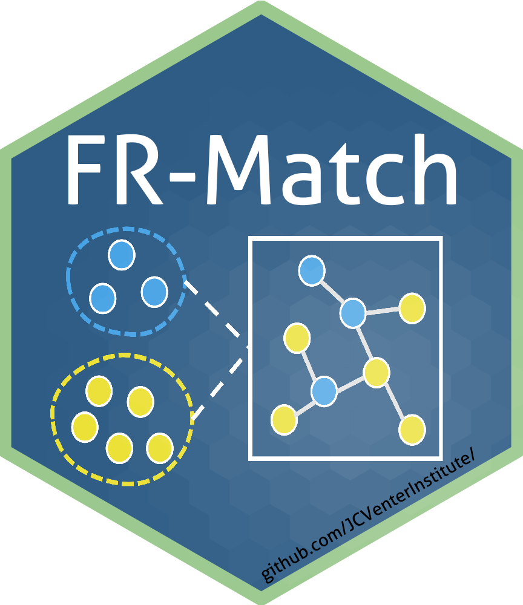
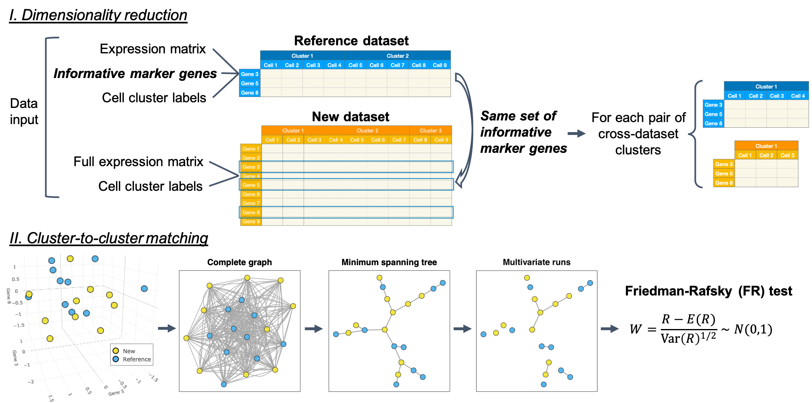

# `frmatch`: A Python package for the FR-Match method

Preprint: Hu et al. 2025. Benchmarking single cell transcriptome matching methods for incremental growth of reference atlases. [https://www.biorxiv.org/content/10.1101/2025.04.10.648034v1](https://www.biorxiv.org/content/10.1101/2025.04.10.648034v1). 

## Download and installation

In terminal: 

```
git clone https://github.com/BeverlyPeng/frmatch.git

cd frmatch

conda env create -f nsforest.yml

conda activate nsforest

pip install .
```

## Tutorial and documentation

Please start from the [tutorials](https://github.com/BeverlyPeng/frmatch/tree/main/tutorials) folder.

Documentation: tbd

## Pipeline



### Prerequisites

* This is a python script written and tested in python 3.11, scanpy 1.9.6.
* Other required libraries: numpy, pandas, sklearn, plotly, time, tqdm.
* Feature selection: [JCVenterInstitute/NSForest](https://github.com/JCVenterInstitute/NSForest)

## Versions and citations
v2.0 (Python):

Hu et al. 2025. Benchmarking single cell transcriptome matching methods for incremental growth of reference atlases. [https://www.biorxiv.org/content/10.1101/2025.04.10.648034v1](https://www.biorxiv.org/content/10.1101/2025.04.10.648034v1). 

v2.0: 

Zhang et al. 2022. Cell type matching in single-cell RNA-sequencing data using FR-Match. *Scientific Reports*, [https://doi.org/10.1038/s41598-022-14192-z](https://doi.org/10.1038/s41598-022-14192-z).

v1.0:

Zhang et al. 2020. FR-Match: robust matching of cell type clusters from single cell RNA sequencing data using the Friedman–Rafsky non-parametric test. *Briefings in Bioinformatics*, [https://doi.org/10.1093/bib/bbaa339](https://doi.org/10.1093/bib/bbaa339).

## Authors

* Beverly Peng (bpeng@jcvi.org)

* Joyce Hu (johu@jcvi.org)

* Richard Scheuermann (richard.scheuermann@nih.gov)

* Yun (Renee) Zhang (yun.zhang@nih.gov)

## License

This project is licensed under the [MIT License](LICENSE).

## Acknowledgments

* Allen Institute for Brain Science
* Chan Zuckerberg Initiative (DAF 2018–182730)
* The NIH BRAIN Initiative (1RF1MH123220)
